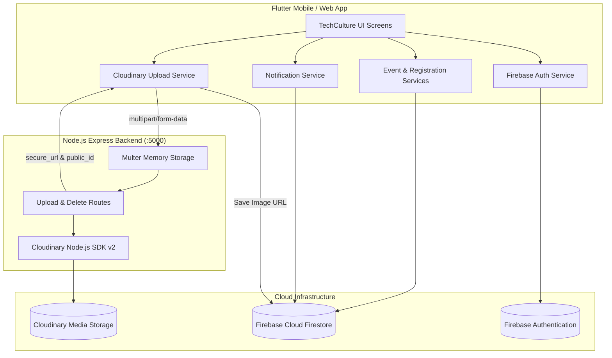

# TechCulture 🚀

A premier technology culture, developer community, and event discovery platform built with **Flutter**, **Firebase**, **Node.js**, and **Cloudinary**. Discover emerging tech trends, explore developer stories, RSVP to technical workshops, hackathons, and webinars, and manage community events seamlessly.

---

## 🌟 Key Features

### 🎪 1. Event Discovery & Exploration
* **Featured & Trending Events**: Interactive carousels highlighting upcoming tech events and trending topics.
* **Category Filtering**: Filter events by `Hackathons`, `Coding`, `Workshops`, `Webinars`, and `Meetups`.
* **Instant Search**: Search events in real time by title, organizer, category, or venue.
* **Responsive Layouts**: Designed to look clean and balanced across all screen sizes with zero layout overflow errors.

### 📝 2. Event Registration & Bookmarking
* **One-Tap RSVP**: Register for events with real-time Firestore synchronization and status tracking.
* **Interactive Bookmarks**: Save events to your personal reading/attending list with instant UI feedback.
* **Registered Events Dashboard**: Track upcoming and past event registrations in one place.

### 🔔 3. Real-Time Notifications System
* **Registration Confirmations**: Automatic in-app notification confirming registration details, event schedule, and venue.
* **24-Hour Event Reminders**: Smart background scanner detects registered events starting within 24 hours and issues starting-soon reminders.
* **Organizer Announcements**: Alerts organizers when events are successfully published and live.
* **Live Unread Bell Badge**: Header AppBar bell icon with a real-time reactive badge counter (`1`..`9+`).
* **Interactive Notifications Screen**:
  * Filter by **All**, **Unread**, **Reminders**, or **Registrations**.
  * Swipe-to-delete with undo support.
  * Direct tap-to-navigate straight to the event details screen.
  * Mark all as read and clear all actions.

### 📸 4. Cloudinary Image Storage & Processing
* **Secure Backend Architecture**: Photos are sent from Flutter to a Node.js Express backend, uploaded securely using the Cloudinary Node.js SDK, and only the resulting lightweight URL & Public ID are stored in Firebase Firestore.
* **Multi-Format Photo Support**: Seamlessly accepts all standard gallery formats: `JPG`, `JPEG`, `PNG`, `WEBP`, `GIF`, `HEIC`, `HEIF`, `BMP`, and `AVIF` up to 25MB.
* **Smart LAN Auto-Discovery**: Automatically resolves the active backend host across physical mobile devices (`192.168.1.7:5000`), Android emulators (`10.0.2.2:5000`), and desktop/web (`localhost:5000`).

### 👤 5. Authentication & User Profiles
* **Firebase Authentication**: Email and password registration, login, and password reset flows.
* **Live Profile Streaming**: Profile picture uploads via Cloudinary with fallback avatar initials, dynamic bio, and account settings.

### 🛠️ 6. Organizer Event Management
* **Publish & Edit Events**: Dedicated forms for organizers to publish new events with high-resolution banner pickers and instant preview.
* **Attendee Tracker**: View and monitor registrations for each organized event.

---

## 🏗️ Architecture & Data Flow



---

## 💻 Tech Stack

| Layer | Technology |
|---|---|
| **Frontend Mobile / Web** | Flutter 3.x, Dart 3.x |
| **State & Navigation** | `go_router`, StatefulWidgets with Streams |
| **Authentication** | Firebase Authentication |
| **Database** | Google Cloud Firestore |
| **Media Processing** | Cloudinary (via Node.js Express Backend) |
| **Backend API** | Node.js, Express.js, Multer |
| **Design & Styling** | Material 3 with Custom TechCulture Orange Theme |

---

## 📁 Project Structure

```text
techculture/
├── android/                   # Android native platform code
├── ios/                       # iOS native platform code
├── web/                       # Web platform entry & manifest
├── backend/                   # Node.js Express Backend for Cloudinary
│   ├── src/
│   │   ├── config/
│   │   │   └── cloudinary.js  # Cloudinary SDK initialization & status
│   │   ├── middleware/
│   │   │   └── upload.js      # Multer memory storage & photo format filter
│   │   ├── routes/
│   │   │   └── upload.js      # Event & profile image upload endpoints
│   │   └── server.js          # Express app entry point & health check
│   ├── .env.example           # Environment template for backend
│   └── package.json           # Backend dependencies
├── lib/
│   ├── core/
│   │   ├── constants/         # App constants & platform API endpoints
│   │   ├── routes/            # Declarative GoRouter routing definitions
│   │   ├── services/          # Cloudinary upload service
│   │   └── theme/             # TechCulture typography, colors & theme
│   ├── features/
│   │   ├── authentication/    # Login, Register, Forgot Password, AuthGate
│   │   ├── bookmarks/         # Saved events list & bookmark service
│   │   ├── events/            # Event models, repositories, and details
│   │   ├── explore/           # Category exploration & discovery
│   │   ├── home/              # Dashboard, featured/trending lists & app bar
│   │   ├── notifications/     # Notifications model, service, screen & bell
│   │   ├── organizer/         # Event form, attendee management
│   │   ├── profile/           # User profile screen & avatar picker
│   │   ├── registrations/     # RSVP models and user registration screen
│   │   ├── search/            # Event search and filter screen
│   │   └── splash/            # Animated splash screen
│   └── main.dart              # Application entry point
├── pubspec.yaml               # Flutter package dependencies
├── .gitignore                 # Production Git ignore rules
└── README.md                  # Project documentation
```

---

## 🚀 Getting Started

### Prerequisites
* [Flutter SDK](https://docs.flutter.dev/get-started/install) (version `^3.7.0` or higher)
* [Node.js](https://nodejs.org/) (version `18.x` or higher) & `npm`
* [Git](https://git-scm.com/)

---

### Step 1: Clone the Repository
```bash
git clone https://github.com/your-username/techculture.git
cd techculture
```

---

### Step 2: Configure & Start the Backend

1. Navigate to the backend directory and install dependencies:
   ```bash
   cd backend
   npm install
   ```

2. Create your `.env` file from the example template:
   ```bash
   cp .env.example .env
   ```

3. Open `backend/.env` and add your Cloudinary credentials from your [Cloudinary Dashboard](https://cloudinary.com):
   ```env
   PORT=5000
   NODE_ENV=development

   CLOUDINARY_CLOUD_NAME=your_cloud_name
   CLOUDINARY_API_KEY=your_api_key
   CLOUDINARY_API_SECRET=your_api_secret
   ```

4. Start the backend server:
   ```bash
   npm start
   ```
   You should see:
   ```text
   ✅ Cloudinary configured successfully for cloud: your_cloud_name
   🚀 TechCulture backend listening on http://0.0.0.0:5000
   📡 Health check: http://localhost:5000/health
   ```

---

### Step 3: Run the Flutter Application

1. Return to the project root directory and fetch dependencies:
   ```bash
   cd ..
   flutter pub get
   ```

2. Run the application on your connected device or emulator:
   ```bash
   # Run on default connected device
   flutter run

   # Or specify target device
   flutter run -d chrome     # Web
   flutter run -d android    # Android device/emulator
   flutter run -d ios        # iOS simulator
   ```

> [!TIP]
> When running on a **physical Android/iOS phone**, ensure your phone is on the same Wi-Fi network as your development machine. The app automatically connects to your machine's LAN IP (`192.168.1.7:5000`) for image uploads.

---

## 🔌 Backend API Reference

| Method | Endpoint | Description |
|---|---|---|
| `GET` | `/health` | Server health check and Cloudinary configuration status |
| `POST` | `/api/upload/event-image` | Uploads event banner photo to `techculture/events` |
| `POST` | `/api/upload/profile-image` | Uploads profile picture to `techculture/profiles` |
| `POST` | `/api/upload/delete` | Deletes an image from Cloudinary by `public_id` |

---

## 🔒 Security Best Practices

* **Zero Secrets in Client**: Cloudinary API secret keys are stored **only** in `backend/.env` and never bundled inside the Flutter client APK or web build.
* **No Binary Files in Database**: Cloud Firestore stores only lightweight CDN image URLs and public IDs, keeping reads fast and database costs minimal.
* **Environment Integrity**: `.env` and `node_modules` are excluded from version control via `.gitignore`. A clean `.env.example` is provided for safe onboarding.

---

## 🤝 Contributing

Contributions are welcome! To contribute:
1. Fork the Project
2. Create your Feature Branch (`git checkout -b feature/AmazingFeature`)
3. Commit your Changes (`git commit -m 'Add some AmazingFeature'`)
4. Push to the Branch (`git push origin feature/AmazingFeature`)
5. Open a Pull Request

---

## 📄 License

This project is licensed under the MIT License - see the [LICENSE](LICENSE) file for details.
